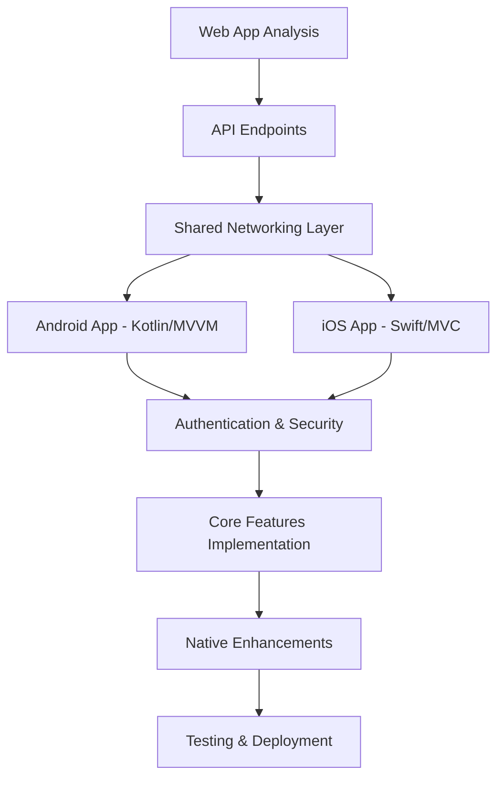

# Mobile Apps Recreation Plan

## Overview
Recreate the Demony investment platform as native mobile apps for Android (Kotlin) and iOS (Swift), replicating the web app's mobile view with enhanced native features. Focus on security, simplicity, and current features.

## Architecture

## Key Requirements
- **Languages**: Kotlin for Android, Swift for iOS
- **Architecture**: MVVM (Android), MVC (iOS)
- **Security**: Secure API communication, biometric auth, data encryption
- **Features**: All web app features (Home, Projects, Wallet, Investments, Portfolio, Support, Profile, Referrals, Settings)
- **Native Features**: Push notifications, offline caching, deep linking
- **UI/UX**: Adapt web app's mobile styles for native platforms

## Implementation Steps
1. Analyze current web app features and API endpoints
2. Design native app architecture (MVVM for Android, MVC for iOS)
3. Set up Android project with Kotlin and necessary dependencies
4. Set up iOS project with Swift and necessary frameworks
5. Implement authentication and secure API communication
6. Create shared networking layer for API calls
7. Build Home/Dashboard screen with stats and featured projects
8. Build Projects screen with browsing and investment functionality
9. Build Wallet screen with balance and transaction history
10. Build Investments screen showing user's active investments
11. Build Portfolio screen with performance charts
12. Build Profile screen with user information
13. Build Referrals screen with referral program
14. Build Settings screen with app preferences
15. Build Support screen with help and contact
16. Implement push notifications for both platforms
17. Add biometric authentication for login
18. Implement offline data caching
19. Add deep linking support
20. Test apps on devices and emulators
21. Prepare for app store submission (certificates, icons, screenshots)
22. Submit to Google Play Store and Apple App Store

## Security Considerations
- HTTPS for all API calls
- JWT token storage with encryption
- Biometric authentication for sensitive operations
- Certificate pinning
- Input validation and sanitization
- Secure key storage for API keys

## Dependencies
- **Android**: Retrofit (networking), Room (database), Glide/Picasso (images), BiometricPrompt (auth)
- **iOS**: URLSession/Alamofire (networking), CoreData (database), SDWebImage (images), LocalAuthentication (auth)

## Testing Strategy
- Unit tests for business logic
- Integration tests for API calls
- UI tests for critical flows
- Device testing on various Android/iOS versions
- Security testing and penetration testing